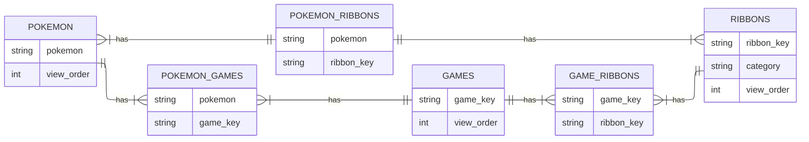

# Ribbon Quest Server

## How to run

1. Configure `config.dev.yml` to connect to the database
2. Ensure that all SQL scripts in `sql` have been ran
3. Inside `rq-server` run `go get`
4. Inside `rq-server` run `ENVIRONMENT=dev go run .`

## Physical Data Model

